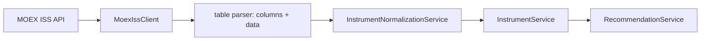

# Интеграция с MOEX ISS

MOEX Select использует открытый информационно-статистический сервер Московской Биржи как источник каталогов и текущих доступных рыночных показателей.

> Информация не является индивидуальной инвестиционной рекомендацией. Подбор основан на выбранных пользователем параметрах и открытых рыночных данных MOEX ISS.

Официальная справка: [ISS Queries](https://iss.moex.com/iss/reference/)

## Используемые наборы данных

| Класс | ISS endpoint |
| --- | --- |
| Акции | `/iss/engines/stock/markets/shares/boards/TQBR/securities.json?iss.meta=off` |
| Облигации | `/iss/engines/stock/markets/bonds/securities.json?iss.meta=off` |
| Фьючерсы | `/iss/engines/futures/markets/forts/securities.json?iss.meta=off` |
| Опционы | `/iss/engines/futures/markets/options/securities.json?iss.meta=off` |

Справочник ISS также предоставляет запросы по конкретной бумаге, историческим данным, свечам и рассчитанным доходностям:

- `/iss/securities/{security}`;
- `/iss/engines/{engine}/markets/{market}/securities/{security}/candles`;
- `/iss/history/engines/{engine}/markets/{market}/securities/{security}`;
- `/iss/history/engines/{engine}/markets/{market}/yields/{security}`.

## Поток данных



## Формат таблиц ISS

Ответ ISS обычно содержит таблицы сведений об инструменте и рыночных данных:

```json
{
  "securities": {
    "columns": ["SECID", "SHORTNAME", "BOARDID"],
    "data": [["SBER", "Сбербанк", "TQBR"]]
  },
  "marketdata": {
    "columns": ["SECID", "LAST", "VOLUME", "VALUE"],
    "data": [["SBER", 315.4, 18500000, 5820000000]]
  }
}
```

`MoexIssClient.tableToDicts` преобразует каждую таблицу в список карт `поле -> значение`, затем строки `securities` и `marketdata` объединяются по `SECID`.

## Нормализация

`InstrumentNormalizationService` приводит разные поля рынков к общей модели:

| Нормализованное поле | ISS поля-кандидаты |
| --- | --- |
| `ticker` | `SECID` |
| `name` | `SHORTNAME`, `SECNAME`, `NAME` |
| `price` | `LAST`, `MARKETPRICE`, `PREVPRICE`, `LCURRENTPRICE` |
| `yieldValue` | `YIELD`, `YIELDATPREVWAPRICE`, `EFFECTIVEYIELD` |
| `volume` | `VOLTODAY`, `VOLUME` |
| `turnover` | `VALTODAY`, `TURNOVER`, `VALUE` |
| `currency` | `CURRENCYID`, `FACEUNIT`, `CURRENCY` |
| `maturityDate` | `MATDATE`, `MATURITYDATE`, `MATUREDATE` |
| `board` | `BOARDID` |
| `marketCap` | `ISSUECAPITALIZATION`, `MARKETCAP`, `MARKETCAPITALIZATION` |
| `optionType` | `OPTIONTYPE`, `OPTIONTYPEID`, `OPTION_TYPE` |
| `strikePrice` | `STRIKE`, `STRIKEPRICE`, `STRIKE_PRICE` |

При наличии дневных полей `VOLTODAY` и `VALTODAY` они имеют приоритет перед значениями отдельной сделки, поскольку ликвидность оценивается по торговому дню. Если поле отсутствует, в модели остается `null`. Невалидные даты погашения и аномальные значения доходности не используются в карточке или ранжировании.

## Получение и кэширование

`WebClient` настроен на базовый адрес `https://iss.moex.com` и ограничивает ожидание ответа. `InstrumentService` хранит последнюю успешно собранную коллекцию в памяти в течение пяти минут.

При временной недоступности данных для одного класса инструментов используется встроенный резервный каталог этого класса. В интерфейсе сохраняется единый пользовательский формат карточек и объяснений.
