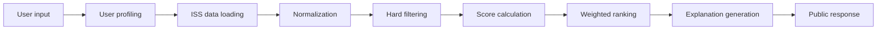

# Recommendation engine

MOEX Select использует объяснимый rule-based / scoring-based recommendation engine. Он сопоставляет параметры пользователя с открытыми данными MOEX ISS и формирует порядок выдачи инструментов.

> Информация не является индивидуальной инвестиционной рекомендацией. Подбор основан на выбранных пользователем параметрах и открытых рыночных данных MOEX ISS.

## Поток обработки



## 1. User input

Запрос содержит:

- `goal`: `CAPITAL_PRESERVATION`, `STABLE_INCOME`, `CAPITAL_GROWTH`, `SPECULATION`;
- `riskProfile`: `LOW`, `MEDIUM`, `HIGH`;
- `horizon`: `SHORT`, `MEDIUM`, `LONG`;
- `budget`: доступная сумма;
- `experience`: `BEGINNER`, `INTERMEDIATE`, `ADVANCED`;
- `assetClasses`: `STOCK`, `BOND`, `FUTURE`, `OPTION`;
- `limit`: максимальное число карточек.

## 2. User profiling

Внутренний профиль задает веса ранжирования:

| Профиль | Правило определения |
| --- | --- |
| `CONSERVATIVE` | `LOW` и цель `CAPITAL_PRESERVATION` или `STABLE_INCOME` |
| `BALANCED` | `MEDIUM` либо профиль без более специфичного правила |
| `AGGRESSIVE` | `HIGH` и цель `CAPITAL_GROWTH` или `SPECULATION` |
| `PROFESSIONAL` | `ADVANCED` и явно выбран `FUTURE` или `OPTION` |

Профиль `PROFESSIONAL` определяется первым, поскольку явный выбор сложного инструмента с продвинутым опытом меняет способ ранжирования.

## 3. Data and normalization

Рыночные таблицы загружаются через `MoexIssClient` и приводятся `InstrumentNormalizationService` к модели:

```text
Instrument
  ticker, name, assetClass, price, currency, yieldValue,
  volume, turnover, volatility, creditRating, maturityDate,
  board, raw
```

Отсутствующее необязательное поле не останавливает обработку. Для внутреннего расчета при отсутствии показателя используется нейтральное значение либо базовая оценка класса инструмента.

## 4. Hard filtering

До расчета порядка выдачи применяются правила допуска:

- пользователь с опытом `BEGINNER` не получает производные инструменты в смешанной подборке;
- если такой пользователь явно выбирает только `FUTURE` и/или `OPTION`, карточки возможны с обязательным сообщением о сложности;
- для профиля `LOW` исключаются инструменты с крайне низкой оценкой ликвидности;
- производные инструменты для профиля `LOW` получают существенное понижение внутренних значений риска и соответствия.

Фильтрация является защитным слоем перед ранжированием: она исключает очевидно несоответствующие карточки, а не заменяет методику сравнения оставшихся инструментов.

## 5. Internal scores

Значения рассчитываются в диапазоне от `0` до `100` в `ScoringService`. Они используются внутри backend для сортировки и не показываются в пользовательском интерфейсе.

### `liquidityScore`

При доступных `turnover` и `volume`:

```text
liquidityScore =
  0.6 * normalized(log(turnover + 1)) +
  0.4 * normalized(log(volume + 1))
```

Если доступен один показатель, используется он. Если оба отсутствуют, значение равно `50`.

### `yieldScore`

Для доступного `yieldValue` применяется нормализация показателя доходности. Для облигаций он извлекается из полей `YIELD`, `YIELDATPREVWAPRICE` или `EFFECTIVEYIELD`. При отсутствии данных значение равно `50`.

Показатель служит только для относительного ранжирования карточек в выбранной группе.

### `riskScore`

При наличии волатильности чем ниже волатильность, тем выше внутреннее значение соответствия по риску:

```text
riskScore = 100 - normalized(volatility)
```

При отсутствии волатильности используются базовые значения:

| Класс | Значение |
| --- | ---: |
| `BOND` | 75 |
| `STOCK` | 60 |
| `FUTURE` | 35 |
| `OPTION` | 25 |

### `creditQualityScore`

| Рейтинг | Значение |
| --- | ---: |
| `AAA` | 100 |
| `AA` | 90 |
| `A` | 80 |
| `BBB` | 65 |
| `BB` | 45 |
| `B` и ниже | 25 |
| Рейтинг облигации отсутствует | 40 |
| Инструмент не является облигацией | 60 |

### `fitScore`

Предполагаемый уровень риска инструмента:

| Класс | Уровень |
| --- | --- |
| `BOND` | низкий либо средний с учетом кредитного качества |
| `STOCK` | средний |
| `FUTURE`, `OPTION` | высокий |

Совпадение с выбранным `riskProfile` дает `100`, отличие на один уровень - `60`, на два уровня - `20`.

## 6. Weighted ranking

```text
finalScore =
  w1 * liquidityScore +
  w2 * yieldScore +
  w3 * riskScore +
  w4 * creditQualityScore +
  w5 * fitScore
```

| Профиль | Ликвидность | Доходность | Риск | Кредитное качество | Соответствие |
| --- | ---: | ---: | ---: | ---: | ---: |
| `CONSERVATIVE` | 0.25 | 0.15 | 0.25 | 0.25 | 0.10 |
| `BALANCED` | 0.25 | 0.25 | 0.20 | 0.15 | 0.15 |
| `AGGRESSIVE` | 0.20 | 0.35 | 0.15 | 0.10 | 0.20 |
| `PROFESSIONAL` | 0.30 | 0.25 | 0.15 | 0.05 | 0.25 |

Консервативный профиль сильнее учитывает риск и кредитное качество; сбалансированный распределяет влияние между основными факторами; агрессивный увеличивает вклад рыночной возможности и соответствия выбранному риску; профессиональный уделяет повышенное внимание ликвидности и выбранному классу.

## 7. Explanation layer

После сортировки `ExplanationService` формирует от двух до четырех фраз без числовых оценок:

- `Соответствует выбранному уровню риска.`
- `Подходит под выбранный горизонт инвестирования.`
- `Имеет достаточную ликвидность для частного инвестора.`
- `Доходность находится среди более привлекательных в выбранной группе инструментов.`
- `Кредитное качество соответствует консервативному профилю.`

Для карточки `FUTURE` или `OPTION` API всегда возвращает сообщение:

`Инструмент относится к сложным финансовым инструментам и подходит только пользователям с соответствующим опытом.`

## 8. Public and diagnostic responses

Обычный `POST /api/recommendations` возвращает карточки без `internalScores`. Именно этот режим использует React-приложение.

Запрос `POST /api/recommendations?debug=true` добавляет `internalScores` к карточке для проверки формул и порядка выдачи командой. Этот режим не вызывается пользовательским интерфейсом.
